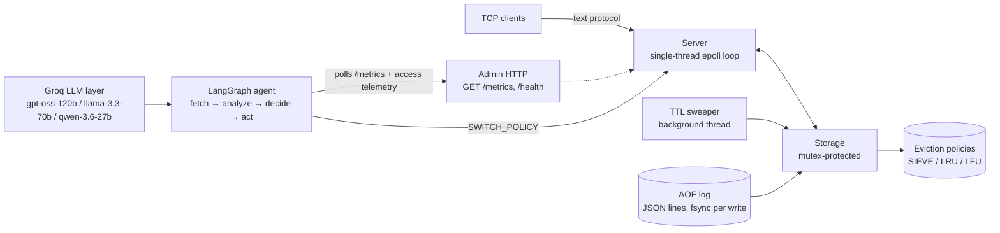

# AdaptiCache

A self-tuning in-memory cache server written in C++17, paired with an autonomous LangGraph agent that swaps eviction policies at runtime to match the workload — no restart, no downtime.

- **Cache core:** single-threaded epoll event loop, SIEVE / LRU / LFU eviction, TTL, AOF persistence
- **Tuning agent:** rule-based + optional LLM decision modes with cooldown and rollback guardrails
- **Benchmark harness:** fresh-server, equal-pressure, multi-seed A/B comparisons with honest reporting

## What this project does

The cache itself is a small, fast Redis-style server. The interesting part is what happens above it: a LangGraph agent watches live telemetry (hit rate, policy, eviction rate), classifies the workload, and issues `SWITCH_POLICY` commands over TCP — every switch is logged, and a rollback guardrail reverts any change that makes the hit rate drop more than 10%.

Three decision modes are available and A/B comparable on identical workloads (plus `hybrid_conflict`, the current experiment under test):

| Mode | Behavior |
|---|---|
| `rule` | Heuristic classifier: zipf skew → SIEVE, scanning → LRU, stable → LFU, bursty → SIEVE |
| `hybrid` | Rule decides; the LLM is consulted on switch proposals as a **diagnostic annotator** (approve/confidence/reason logged, cannot veto) |
| `hybrid_conflict` | Rule + deterministic eviction-physics signal (burst-pool survival ETA); the LLM arbitrates **only** when they genuinely disagree (scoped veto) |
| `llm` | LLM picks the policy each cycle — **deprecated**: lost to rule in controlled experiments (see below) |

The LLM layer is strictly opt-in (Groq, round-robin across three models with failover), costs on the order of $0.002-0.009 per full benchmark run, and falls back to rules on any failure.  All LLM consults are **fire-and-forget** (async worker threads): the rule decision always executes at grid time, so consult latency can never shift the switch positions (this fixed a harness artifact that swung the previous compare +13..20 pt).

### Results at a glance (90K requests, 1 MB cache, 5 seeds: 1/7/42/123/999, preload-gated 2026-08-10 regen)

Adversarial churn (0.50/0.50 — the verified-divergence config):

| Mode | Overall hit rate (mean ± std) | vs Rule |
|---|---|---|
| **rule** | **25.0% ± 4.9** | — |
| llm (deprecated) | 25.0% ± 4.9 | −0.1 pt |
| hybrid (diagnostic) | 24.9% ± 5.0 | −0.1 pt |
| hybrid_conflict | 25.0% ± 5.0 | −0.1 pt |
| hybrid_echo (control) | 24.9% ± 5.0 | −0.1 pt |

Moderate churn (0.30/0.30): rule 36.6% ± 5.5, llm 36.8% ± 5.6 (+0.1 pt — the previously reported +1.3 pt edge was a harness artifact), hybrid 36.7% ± 5.5, hybrid_conflict 36.7% ± 5.4.

**The headline result is now the static comparison:** with the preload gate active, every decision mode lands within 0.15 pt of rule (echo-control gaps 0.09–0.14 pt — clean), and **all of them lose to static lfu/sieve by ~5.4 pt** (rule 0.2503 vs 0.3041: the agent's early lfu switch wins P1/P2 by +3.7/+1.6 pt, then the rollback/rebuild thrash loses P3 by −20.2 pt). The earlier recorded numbers (rule 65%, llm 74.8%) were inflated by a second harness artifact — the agent's first decision raced the benchmark's preload and rebuilt the policy on a half-loaded map (a `SWITCH_POLICY` rebuild re-adds keys in `unordered_map` hash order, scrambling the eviction frontier). Fixed with a `MARK_PRELOADED` preload gate + decision-grid quantization; every recorded number in this README and `agent/RESULTS_COMPARISON.md` was regenerated after the fix. The LLM layer adds cost and latency for noise: after five controlled experiments (un-gated consults cost 26–41 pt; evidence-gated vetoes became static-LFU; a confidence gate never opened; fire-and-forget async consults; preload-gated regeneration) no LLM mode has ever beaten rule, and experiment 4 — a deterministic physics signal with LLM arbitration of genuine rule-vs-physics conflicts — remains a systematic null (0 conflicts in five clean multi-seed runs).

## Architecture



The agent decision cycle:

```mermaid
sequenceDiagram
    participant B as Benchmark / workload
    participant AG as LangGraph agent
    participant C as Cache server
    participant G as Groq LLM

    loop every interval (default 1s)
        AG->>C: poll /metrics + access telemetry
        C-->>AG: hit_rate, policy, workload signals
        AG->>AG: classify (zipf / scan / churn)
        alt decision_mode = hybrid / hybrid_conflict (diagnostic/arbiter)
            opt rule proposes a switch (or rule-physics conflict)
                AG-->>G: consult (FIRE-AND-FORGET: async worker thread)
                G-->>AG: eval / arbitration (logged; never blocks a switch)
            end
        end
        opt target != current and cooldown ok
            AG->>C: SWITCH_POLICY <target>
            C-->>AG: +OK (policy swapped atomically)
        end
        AG->>AG: 3-snapshot guardrail: revert if hit rate drops >10%
    end
```

## Tech Stack

| Component | Technology |
|---|---|
| Cache server | C++17, epoll (poll-based shim on macOS), `-O2` |
| Eviction policies | Hand-rolled SIEVE (NSDI 2024) linked list, LRU, LFU frequency buckets |
| Persistence | AOF append-only log, one JSON line per write, synchronous fsync, replay on boot |
| JSON | nlohmann/json (vendored single header, only dependency) |
| Agent framework | Python 3.12, LangGraph (StateGraph) |
| LLM inference | Groq: gpt-oss-120b, llama-3.3-70b-versatile, qwen-3.6-27b (round-robin + failover) |
| Benchmarking | Custom phased generator: zipf skew, hot+scan, mixed phases with burst + churn |
| Tests | Plain C++17 assertions, zero test framework, `make test` |

## Key Design Decisions

**Why SIEVE?** SIEVE is the 2024 cache-eviction successor to LRU: a single hand pointer walks the list clearing a `visited` bit, making the hot working set cheap to protect and the cold tail trivial to evict. It costs O(1) amortized per operation and beats LRU in the scan-heavy phase of the benchmark. The policy interface (`touch` / `add` / `remove` / `evict`) means all three policies are drop-in switchable at runtime.

**Why a single-threaded epoll loop?** One thread, one `epoll_wait`, per-client buffers, `EPOLLOUT`-based pending sends. No locks in the hot path — the only contention is the TTL sweeper, which takes the storage mutex for expired keys. The admin server runs its own epoll loop on a worker thread. This keeps the concurrency story simple enough to reason about and debug.

**Why synchronous AOF fsync?** Durability over speed: every SET/DEL is appended and flushed before the response is sent, and the log is replayed on boot. Write throughput suffers by design; the project prefers being able to prove nothing is lost on crash.

**Why an agent instead of a static policy?** Real workloads shift, and the agent's early switch does buy real P1/P2 gains (+3.7/+1.6 pt over static lfu) — but the controlled answer is more honest: on this benchmark, the rule agent's switching costs more than it earns (P3 −20.2 pt from rollback/rebuild thrash; overall −5.4 pt vs static lfu/sieve). The project's value is in *proving* that: a benchmark harness with fresh-server equal-pressure A/Bs, multi-seed verdicts, echo timing controls, and two caught-and-fixed harness artifacts (synchronous LLM consult latency; a mid-preload switch racing the preload loop). The agent infrastructure (rule classifier, cooldown, rollback guardrail, fire-and-forget LLM consults) remains fully implemented and tested; the measurements just say a static LFU/SIEVE is the better default on this workload.

**Why hybrid?** Hybrid is now a **diagnostic layer**: the rule decides, and the LLM annotates switch proposals (approve/confidence/reason) in the decision log. Five controlled 5-seed experiments led to this demotion: (1) un-gated consults let the LLM veto the pre-workload lru→lfu switch ("no activity, keep current stable policy") and cost 26–41 pt; (2) evidence-gated vetoes made the LLM veto 66.7% of proposals — hybrid became static LFU with a −10 pt P2 / +12 pt P3 trade, i.e. the veto's default action, not insight; (3) a rule-confidence gate plus raw zipf/scan/churn/trend/switch-history signals produced no improvement — the gate never opened in request-quantized mode and the enriched `llm` mode still flip-flopped (±4.1 pt across seeds; per-seed −3.6 to +7.4 pt is a roll, not a strategy); (4) fire-and-forget async consults (the rule executes at grid time; LLM verdicts annotate after the fact) fixed the sync-consult artifact that swung run 4a +13..20 pt; (5) the preload gate fixed the mid-preload-switch artifact that had inflated every mode by ~0.3-0.4 — after which no mode differs from rule by more than 0.15 pt in either regime. Experiment 4 (`hybrid_conflict` — a deterministic burst-pool-survival physics signal with LLM arbitration of genuine rule-vs-physics conflicts) is a systematic null: the physics signal fired exactly once per seed at the breach moment and always agreed with the rule, so the arbiter was never exercised in five clean multi-seed runs. `llm` mode remains opt-in but deprecated; `hybrid` costs ~$0.002 and ~0.6-4.2 s only when a switch is actually proposed — and since consults are fire-and-forget, that latency never shifts the switch grid.

**Why fair A/B?** Every decision-mode sub-run replays the identical workload at identical length on a fresh server. An explicit `--llm-requests` cap (for cheap smoke tests) prints a loud NOT-COMPARABLE warning and is excluded from the report's recommendation. Equal pressure or nothing.

**Why plain-assert tests?** The repo's only dependency is nlohmann/json. Tests are plain C++17 `CHECK` macros compiled straight to binaries — `make test` builds and runs all three, zero framework, zero install step.

## Quick Start

```sh
make                 # builds ./adaptivecache
make test            # builds + runs the unit tests (all green)

./adaptivecache [--port PORT] [--admin-port PORT] \
             [--memory-limit MB] [--aof-file FILE]
```

Defaults: cache port `6379`, admin port `8080`, memory limit `64` MB, AOF file `adapticache.aof`. `SIGINT`/`SIGTERM` trigger graceful shutdown. Builds on Linux (real epoll) and macOS (compatibility shim in `src/epoll_compat.h`).

## Protocol & API

Requests are a single line terminated by `\n` (optionally `\r\n`), whitespace-separated tokens, case-insensitive verbs.

```sh
# SET with optional TTL, then GET
printf 'SET user:42 alice 60\r\nGET user:42\r\n' | nc 127.0.0.1 6379

# DELETE, policy switch, metrics
printf 'DEL user:42\r\nSWITCH_POLICY sieve\r\nMETRICS\r\n' | nc 127.0.0.1 6379
```

| Command | Response |
|---|---|
| `SET key value [ttl_sec]` | `+OK` |
| `GET key` | `$<len>\r\n<value>` on hit, `$-1` on miss |
| `DEL key` | `:1` removed / `:0` absent |
| `METRICS` | JSON: hits, misses, hit_rate, evictions, memory_bytes, policy, total_keys |
| `SWITCH_POLICY lru\|lfu\|sieve` | `+OK` (case-insensitive; unknown name → `-ERR`) |

Admin HTTP (one request per connection, `Connection: close`):

```sh
curl -s http://127.0.0.1:8080/metrics
# {"evictions":0,"hit_rate":0.5,"hits":1,"memory_bytes":6,...}
curl -s http://127.0.0.1:8080/health
# {"status":"ok"}
```

## Benchmarks

`agent/benchmark.py` starts a fresh `adapticache` for every mode, preloads exactly the cache's key capacity, and replays one generated workload so every policy measures the same request sequence.

```sh
python3 agent/benchmark.py --mode all --requests 90000 \
    --cache-size-mb 1 --hot-size 11000 --seed 7
```

### Eviction policies — 5-seed consistency (90K requests, 1 MB cache)

LFU and SIEVE beat LRU in the scan-heavy phases at **every seed** (P3 gap +0.26-0.28 absolute, 2.3x-3.9x relative). Absolute numbers vary seed to seed; the divergence does not.

| Seed | Overall LRU | Overall LFU/SIEVE | P3 LRU | P3 LFU/SIEVE |
|---|---|---|---|---|
| 1 | 0.2517 | 0.3913 | 0.1993 | 0.4634 |
| 7 | 0.1583 | 0.3003 | 0.1153 | 0.3828 |
| 42 | 0.1365 | 0.2778 | 0.0977 | 0.3660 |
| 123 | 0.1278 | 0.2670 | 0.0909 | 0.3536 |
| 999 | 0.1407 | 0.2839 | 0.0969 | 0.3679 |

Workload design (why this diverges at all): this server never inserts on GET miss and every SET evicts exactly one key, so the eviction frontier walks the preload order under cold churn — even zipf-hot ranks die. The burst pool sits at the preload tail and per-phase churn must exceed the burst-key rank offset, or the frontier never reaches the burst keys and every policy scores the same. At `--requests 30000` the churn is too low and all policies measure identically — 90K is the minimum comparable length.

### Decision modes — fair 5-seed comparison (90K requests, equal length, adversarial churn, preload-gated)

| Mode | Overall HR (mean ± std) | P1 HR | P2 HR | P3 HR | Switches | LLM calls | Fallback | Est. cost |
|---|---|---|---|---|---|---|---|---|
| **rule** | **0.2503 ± 0.0493** | 0.3264 | 0.2450 | 0.1852 | 5.6 | 0 | 0% | $0.00 |
| llm (deprecated) | 0.2496 ± 0.0491 | 0.3263 | 0.2442 | 0.1841 | 6.0 | 63 | 0% | ~$0.009 |
| hybrid (diagnostic) | 0.2495 ± 0.0501 | 0.3257 | 0.2441 | 0.1846 | 5.6 | 10 | 0% | ~$0.002 |
| hybrid_conflict | 0.2498 ± 0.0497 | 0.3263 | 0.2440 | 0.1849 | 5.6 | 0 | 0% | $0.00 |
| hybrid_echo (control) | 0.2489 ± 0.0500 | 0.3265 | 0.2425 | 0.1836 | 5.6 | 10 | 0% | $0.00 |
| hybrid_conflict_echo | 0.2499 ± 0.0489 | 0.3263 | 0.2438 | 0.1853 | 5.8 | 0 | 0% | $0.00 |

No mode beats rule by ≥ 1 pt on any seed — **rule is the recommended default**, and it equals the echo control (|rule − echo| = 0.14 pt < 0.5 pt control bound). Under **moderate churn** (0.30/0.30) the same story holds: rule 0.3662, llm 0.3677 (+0.15 pt — the previously reported +1.3 pt adopt-bar result was part of the preload-gate artifact and does not reproduce), echo gap 0.09 pt. `hybrid_conflict` arbitrated **zero** conflicts across all five clean multi-seed runs (the physics signal always agrees with the rule). These numbers are the 2026-08-10 preload-gated regeneration; the 2026-08-09 tables (rule 0.6506, llm 0.7482) were inflated by the mid-preload-switch artifact and are superseded. Full detail: `agent/RESULTS_COMPARISON.md` (regenerate with `python3 agent/compare_report.py --results ./compare_results.json`).

### Rule agent vs static policies — same-run 5-seed table (2026-08-10, preload-gated)

One `--mode all` invocation per seed (same 90K/1MB/11000 config, same harness, same 5 seeds) puts the rule agent, the three static policies, and four **rebuild-control** modes (same-policy `SWITCH_POLICY` re-issues at fixed request positions) in a single table. The static rows reproduce the eviction sweep above to 4 decimals, confirming the workloads are byte-identical.

| Mode | Overall (mean ± std) | P1 | P2 | P3 |
|---|---|---|---|---|
| static_lru | 0.1630 ± 0.0508 | 0.2885 | 0.0846 | 0.1200 |
| static_sieve | 0.3041 ± 0.0502 | 0.2890 | 0.2293 | 0.3867 |
| static_lfu | 0.3041 ± 0.0502 | 0.2890 | 0.2293 | 0.3867 |
| **pilot (rule agent)** | **0.2482 ± 0.0490** | 0.3207 | 0.2443 | 0.1854 |
| static_sieve_rebuild (1 @ 7K) | 0.1767 ± 0.0499 | 0.3074 | 0.1136 | 0.1147 |
| sieve_at_schedule (5 rebuilds) | 0.2490 ± 0.0493 | 0.3106 | 0.2517 | 0.1900 |
| lfu_at_schedule (5 rebuilds) | 0.2490 ± 0.0493 | 0.3106 | 0.2517 | 0.1900 |
| static_lfu_derange (rebuild every 15K) | 0.2864 ± 0.0510 | 0.2943 | 0.3254 | 0.2434 |

**The rebuild is the agent's only lever — and it's a net tax.** `sieve_at_schedule` and `lfu_at_schedule` pin *different* policies but re-issue `SWITCH_POLICY` at the agent's own switch positions, and they measure identically (0.2490) to the pilot (0.2482) to ~0.1 pt: every `SWITCH_POLICY` rebuilds the policy by re-adding resident keys in `unordered_map` hash order, which scrambles the eviction frontier, and that scramble — not the policy choice — determines the outcome. Rebuilds hurt monotonically at the agent's positions: static lfu/sieve (0 rebuilds) 0.3041 > pilot/at_schedule (5) 0.248-0.249 > single rebuild at 7K 0.1767. The agent's only adaptive gains are real but small: P1 +3.2 pt and P2 +1.5 pt over static lfu from its early lfu switch (a preload-gated, request-quantized decision at exactly request 5000), paid for with a P3 −20.1 pt collapse where the rollback/rebuild thrash destroys the burst pool (pilot P3 0.1854 vs static lfu 0.3867).

Takeaway: the 2026-08-09 "rule beats static by ~35 pt" table was 100% artifact — that run's first switch raced the preload loop and rebuilt the policy mid-fill. With the preload gate, the honest verdict is **static lfu/sieve > rule agent (−5.4 pt) > static lru**, and the rebuild-control modes pin the mechanism. The defensible claims are (a) the agent's early switch buys real P1/P2 gains, (b) the rollback guardrail contains the downside to ~−5.4 pt (not the −40 pt a bad policy choice would cost), and (c) the harness that caught two artifacts of its own making is the project's actual deliverable.

## Tests

```sh
make test
```

| Test binary | Covers |
|---|---|
| `test_sieve` | insertion-order eviction, `touch()`/visited-skip semantics, middle `remove()` relinking, size accounting |
| `test_protocol` | SET / GET / DEL / METRICS / SWITCH_POLICY parsing, case-insensitivity, whitespace/tab splitting, UNKNOWN verbs |
| `test_storage` | set/get/del + counters, deterministic eviction under a memory limit, policy switching (keys preserved), TTL expiry |

Each binary compiles only the translation units it exercises — the server's `main.cpp` never links into the tests.

## Known Limitations & Future Work

- **The agent loses to static lfu/sieve on this benchmark** (rule 0.2503 vs 0.3041 adversarial, preload-gated) — the measured answer, not the hoped-for one. The rule agent's switching pays a rebuild-scramble tax that costs more than its P1/P2 adaptation earns; a static policy is the better default on this workload. Future work: a switch primitive that does *not* rebuild (true incremental policy migration) — the rebuild is the tax.
- **The rule agent can thrash.** The 90K rule trace shows sieve↔lfu flip-flops with rollback churn; cooldown bounds but does not eliminate it.
- **LLM consults are fire-and-forget by design.** Rule decisions execute at grid time; consult latency (~0.5-3.6s Groq call) is absorbed by async worker threads and llm/arbiter verdicts apply at the next decide point, so latency can never shift the switch grid (a synchronous variant of this cost the previous compare run +13..20 pt of artifact).
- **fsync-per-write AOF** prioritizes durability over write throughput by design.
- **No replication or sharding** — the single epoll thread is the throughput ceiling, and the design favors reasoning about concurrency over scaling out.
- **macOS `epoll_compat.h` is a shim**, not production epoll; the shim has one known race class (shared fake epfd across instances) which is mitigated with an atomic counter + global mutex.
- **No authentication** on the TCP or admin ports — this is a benchmark/research server, not a production deployment.

## License

Academic/research use. The workload generator and benchmark methodology are self-contained; no external datasets are required.
