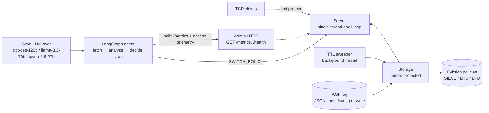
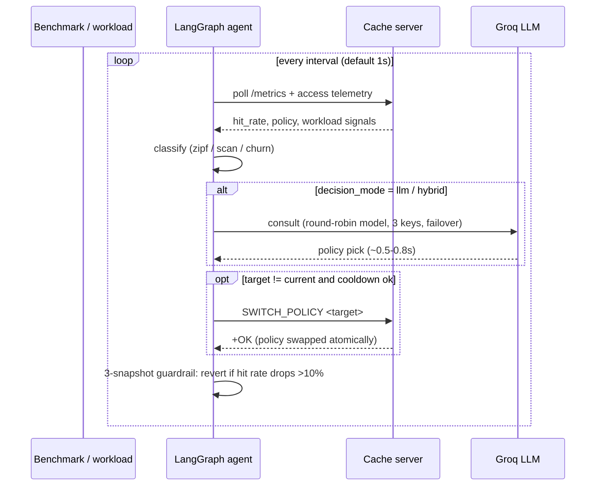

# Kybernetes

A self-tuning in-memory cache server written in C++17, paired with an autonomous LangGraph agent that swaps eviction policies at runtime to match the workload — no restart, no downtime.

- **Cache core:** single-threaded epoll event loop, SIEVE / LRU / LFU eviction, TTL, AOF persistence
- **Tuning agent:** rule-based + optional LLM decision modes with cooldown and rollback guardrails
- **Benchmark harness:** fresh-server, equal-pressure, multi-seed A/B comparisons with honest reporting

## What this project does

The cache itself is a small, fast Redis-style server. The interesting part is what happens above it: a LangGraph agent watches live telemetry (hit rate, policy, eviction rate), classifies the workload, and issues `SWITCH_POLICY` commands over TCP — every switch is logged, and a rollback guardrail reverts any change that makes the hit rate drop more than 10%.

Three decision modes are available and A/B comparable on identical workloads:

| Mode | Behavior |
|---|---|
| `rule` | Heuristic classifier: zipf skew → SIEVE, scanning → LRU, stable → LFU, bursty → SIEVE |
| `llm` | Same telemetry, but the LLM picks the policy each cycle |
| `hybrid` | Rule decides; the LLM acts as a logged second opinion |

The LLM layer is strictly opt-in (Groq, round-robin across three models with failover), costs on the order of $0.001 per benchmark run, and falls back to rules on any failure.

### Results at a glance (90K requests, 1 MB cache, seed 7)

| Mode | Overall hit rate | vs Rule |
|---|---|---|
| rule | 63.5% | — |
| llm | 63.2% | −0.3 pt |
| **hybrid** | **71.5%** | **+8.0 pt** |

Hybrid wins in every benchmark run (also +5.8 pt at 30K). Eviction-policy divergence (LFU/SIEVE vs LRU) is reproducible across 5 seeds. Full numbers: [Benchmarks](#benchmarks) and `agent/RESULTS_COMPARISON.md`.

## Architecture



The agent decision cycle:



## Tech Stack

| Component | Technology |
|---|---|
| Cache server | C++17, epoll (poll-based shim on macOS), `-O2` |
| Eviction policies | Hand-rolled SIEVE (NSDI 2024) linked list, LRU, LFU frequency buckets |
| Persistence | AOF append-only log, one JSON line per write, synchronous fsync, replay on boot |
| JSON | nlohmann/json (vendored single header, only dependency) |
| Agent framework | Python 3.12, LangGraph (StateGraph) |
| LLM inference | Groq: gpt-oss-120b, llama-3.3-70b-versatile, qwen-3.6-27b (round-robin + failover) |
| Benchmarking | Custom phased generator: zipf skew, hot+scan, mixed phases with burst + churn |
| Tests | Plain C++17 assertions, zero test framework, `make test` |

## Key Design Decisions

**Why SIEVE?** SIEVE is the 2024 cache-eviction successor to LRU: a single hand pointer walks the list clearing a `visited` bit, making the hot working set cheap to protect and the cold tail trivial to evict. It costs O(1) amortized per operation and beats LRU in the scan-heavy phase of the benchmark. The policy interface (`touch` / `add` / `remove` / `evict`) means all three policies are drop-in switchable at runtime.

**Why a single-threaded epoll loop?** One thread, one `epoll_wait`, per-client buffers, `EPOLLOUT`-based pending sends. No locks in the hot path — the only contention is the TTL sweeper, which takes the storage mutex for expired keys. The admin server runs its own epoll loop on a worker thread. This keeps the concurrency story simple enough to reason about and debug.

**Why synchronous AOF fsync?** Durability over speed: every SET/DEL is appended and flushed before the response is sent, and the log is replayed on boot. Write throughput suffers by design; the project prefers being able to prove nothing is lost on crash.

**Why an agent instead of a static policy?** Real workloads shift. The benchmark's own phases (skewed → hot+scan → mixed) show that a single fixed policy gives up 14-28 points in hit rate versus the right policy per phase. The agent pays one cheap metrics poll per second to keep the cache on the right policy, and the rollback guardrail bounds the downside of a bad switch.

**Why hybrid?** The LLM agrees with the rules only ~27-42% of the time, yet hybrid wins in both benchmark runs (+5.8pt at 30K, +8.0pt at 90K). The working hypothesis: when the LLM disagrees with the rule, it is usually vetoing or re-timing a switch — rule speed plus LLM caution. This is labeled a hypothesis in the report, not a proven mechanism.

**Why fair A/B?** Every decision-mode sub-run replays the identical workload at identical length on a fresh server. An explicit `--llm-requests` cap (for cheap smoke tests) prints a loud NOT-COMPARABLE warning and is excluded from the report's recommendation. Equal pressure or nothing.

**Why plain-assert tests?** The repo's only dependency is nlohmann/json. Tests are plain C++17 `CHECK` macros compiled straight to binaries — `make test` builds and runs all three, zero framework, zero install step.

## Quick Start

```sh
make                 # builds ./kybernetes
make test            # builds + runs the unit tests (all green)

./kybernetes [--port PORT] [--admin-port PORT] \
             [--memory-limit MB] [--aof-file FILE]
```

Defaults: cache port `6379`, admin port `8080`, memory limit `64` MB, AOF file `kybernetes.aof`. `SIGINT`/`SIGTERM` trigger graceful shutdown. Builds on Linux (real epoll) and macOS (compatibility shim in `src/epoll_compat.h`).

## Protocol & API

Requests are a single line terminated by `\n` (optionally `\r\n`), whitespace-separated tokens, case-insensitive verbs.

```sh
# SET with optional TTL, then GET
printf 'SET user:42 alice 60\r\nGET user:42\r\n' | nc 127.0.0.1 6379

# DELETE, policy switch, metrics
printf 'DEL user:42\r\nSWITCH_POLICY sieve\r\nMETRICS\r\n' | nc 127.0.0.1 6379
```

| Command | Response |
|---|---|
| `SET key value [ttl_sec]` | `+OK` |
| `GET key` | `$<len>\r\n<value>` on hit, `$-1` on miss |
| `DEL key` | `:1` removed / `:0` absent |
| `METRICS` | JSON: hits, misses, hit_rate, evictions, memory_bytes, policy, total_keys |
| `SWITCH_POLICY lru\|lfu\|sieve` | `+OK` (case-insensitive; unknown name → `-ERR`) |

Admin HTTP (one request per connection, `Connection: close`):

```sh
curl -s http://127.0.0.1:8080/metrics
# {"evictions":0,"hit_rate":0.5,"hits":1,"memory_bytes":6,...}
curl -s http://127.0.0.1:8080/health
# {"status":"ok"}
```

## Benchmarks

`agent/benchmark.py` starts a fresh `kybernetes` for every mode, preloads exactly the cache's key capacity, and replays one generated workload so every policy measures the same request sequence.

```sh
python3 agent/benchmark.py --mode all --requests 90000 \
    --cache-size-mb 1 --hot-size 11000 --seed 7
```

### Eviction policies — 5-seed consistency (90K requests, 1 MB cache)

LFU and SIEVE beat LRU in the scan-heavy phases at **every seed** (P3 gap +0.26-0.28 absolute, 2.3x-3.9x relative). Absolute numbers vary seed to seed; the divergence does not.

| Seed | Overall LRU | Overall LFU/SIEVE | P3 LRU | P3 LFU/SIEVE |
|---|---|---|---|---|
| 1 | 0.2517 | 0.3913 | 0.1993 | 0.4634 |
| 7 | 0.1583 | 0.3003 | 0.1153 | 0.3828 |
| 42 | 0.1365 | 0.2778 | 0.0977 | 0.3660 |
| 123 | 0.1278 | 0.2670 | 0.0909 | 0.3536 |
| 999 | 0.1407 | 0.2839 | 0.0969 | 0.3679 |

Workload design (why this diverges at all): this server never inserts on GET miss and every SET evicts exactly one key, so the eviction frontier walks the preload order under cold churn — even zipf-hot ranks die. The burst pool sits at the preload tail and per-phase churn must exceed the burst-key rank offset, or the frontier never reaches the burst keys and every policy scores the same. At `--requests 30000` the churn is too low and all policies measure identically — 90K is the minimum comparable length.

### Decision modes — fair 90K comparison (seed 7, equal length)

| Mode | Overall HR | P1 HR | P2 HR | P3 HR | Switches | LLM calls | Fallback | Est. cost |
|---|---|---|---|---|---|---|---|---|
| rule | 0.6348 | 0.8448 | 0.5240 | 0.5442 | 5 | 0 | 0% | $0.00 |
| llm | 0.6323 | 0.9676 | 0.4398 | 0.5019 | 6 | 11 | 0% | $0.0009 |
| **hybrid** | **0.7151** | 0.9079 | 0.6370 | 0.6102 | 5 | 12 | 0% | $0.0010 |

Hybrid beats rule by **8.0 points**; llm lands within noise of rule (-0.25pt) — at 30K the same comparison showed llm +2.6pt and hybrid +5.8pt, so the robust signal across both runs is that **hybrid wins and the LLM modes never lose**. All 23 LLM consults succeeded (0% fallback), round-robining across all three models; average consult latency ~0.5-0.8s at a 1s agent interval. Full detail: `agent/RESULTS_COMPARISON.md` (regenerate with `python3 agent/compare_report.py --results ./compare_results.json`).

## Tests

```sh
make test
```

| Test binary | Covers |
|---|---|
| `test_sieve` | insertion-order eviction, `touch()`/visited-skip semantics, middle `remove()` relinking, size accounting |
| `test_protocol` | SET / GET / DEL / METRICS / SWITCH_POLICY parsing, case-insensitivity, whitespace/tab splitting, UNKNOWN verbs |
| `test_storage` | set/get/del + counters, deterministic eviction under a memory limit, policy switching (keys preserved), TTL expiry |

Each binary compiles only the translation units it exercises — the server's `main.cpp` never links into the tests.

## Known Limitations & Future Work

- **Decision-mode results are single-run evidence.** The agent's 1s polling cycle aligns to wall clock, not workload position, so switch timing jitter moves the numbers run to run (llm -0.25pt vs rule at 90K is well within that noise). Stronger claims need repeated runs with a mean/std summary.
- **The rule agent can thrash.** The 90K rule trace shows sieve↔lfu flip-flops with rollback churn; cooldown bounds but does not eliminate it.
- **LLM latency is paid synchronously.** One ~0.5-0.8s Groq call per agent cycle makes each cycle dependent on API availability (mitigated by failover + fallback, never by blocking the cache itself).
- **fsync-per-write AOF** prioritizes durability over write throughput by design.
- **No replication or sharding** — the single epoll thread is the throughput ceiling, and the design favors reasoning about concurrency over scaling out.
- **macOS `epoll_compat.h` is a shim**, not production epoll; the shim has one known race class (shared fake epfd across instances) which is mitigated with an atomic counter + global mutex.
- **No authentication** on the TCP or admin ports — this is a benchmark/research server, not a production deployment.

## License

Academic/research use. The workload generator and benchmark methodology are self-contained; no external datasets are required.
