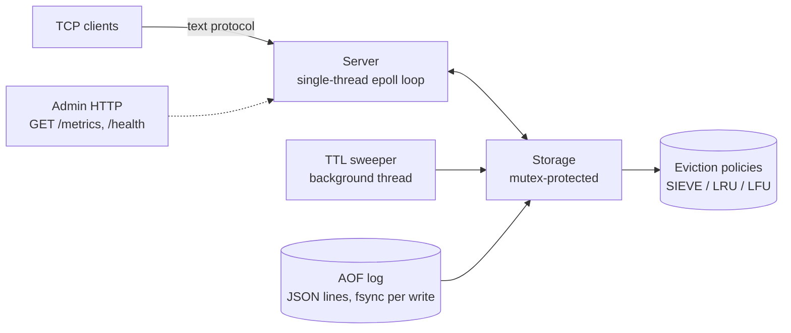

# AdaptiCache

An in-memory cache server written in C++17 with runtime-switchable eviction policies. A single `SWITCH_POLICY` command swaps between SIEVE, LRU, and LFU live — no restart, no downtime.

- **Cache core:** single-threaded epoll event loop, SIEVE / LRU / LFU eviction, TTL, AOF persistence
- **Runtime policy switching:** `SWITCH_POLICY lru|lfu|sieve` over TCP, applied atomically under the storage lock
- **Benchmark harness:** fresh-server, equal-pressure, multi-seed A/B comparisons with honest reporting

## What this project does

The server is a small, fast Redis-style cache: text protocol over TCP, eviction policies behind one interface, a background TTL sweeper, synchronous AOF durability, and an admin HTTP server exposing live metrics. Because every policy implements the same `EvictionPolicy` interface, the active policy can be swapped at runtime without clearing the cache — the eviction frontier is preserved across the rebuild, so a switch costs a metadata sort, not a flush.

A Python benchmark (`benchmark.py`) starts a fresh server per mode, preloads exactly the cache's key capacity, and replays one generated workload so every policy measures the same request sequence. The workload is designed so LRU, LFU, and SIEVE genuinely diverge: a burst pool at the preload tail that LRU drops under cold-insert churn while LFU and SIEVE keep it.

### Results (90K requests, 1 MB cache, 5 seeds: 1/7/42/123/999, adversarial churn 0.50/0.50)

LFU and SIEVE tie and beat LRU, driven by the scan-heavy phases:

| Mode | Overall (mean ± std) | P1 zipf skew | P2 hot+scan | P3 mixed |
|---|---|---|---|---|
| static_lru | 0.1630 ± 0.0508 | 0.2885 | 0.0846 | 0.1200 |
| static_lfu | 0.3041 ± 0.0502 | 0.2890 | 0.2293 | 0.3868 |
| static_sieve | 0.3041 ± 0.0502 | 0.2890 | 0.2293 | 0.3868 |

Per seed, LFU/SIEVE beat LRU at every one (P3 gap +0.26–0.28 absolute, 2.3x–3.9x relative):

| Seed | Overall LRU | Overall LFU/SIEVE | P3 LRU | P3 LFU/SIEVE |
|---|---|---|---|---|
| 1 | 0.2517 | 0.3913 | 0.1993 | 0.4634 |
| 7 | 0.1583 | 0.3003 | 0.1153 | 0.3828 |
| 42 | 0.1365 | 0.2778 | 0.0977 | 0.3660 |
| 123 | 0.1278 | 0.2670 | 0.0909 | 0.3536 |
| 999 | 0.1407 | 0.2839 | 0.0969 | 0.3679 |

## Architecture



A `SWITCH_POLICY` command tells `Storage` to rebuild its eviction index under the target policy. The rebuild preserves the frontier: keys are re-added in eviction order (recency for LRU/SIEVE, frequency for LFU), so switching policies at runtime never scrambles the cache contents — and a same-policy switch is a literal no-op.

## Tech Stack

| Component | Technology |
|---|---|
| Cache server | C++17, epoll (poll-based shim on macOS), `-O2` |
| Eviction policies | Hand-rolled SIEVE (NSDI 2024) linked list, LRU, LFU frequency buckets |
| Persistence | AOF append-only log, one JSON line per write, synchronous fsync, replay on boot |
| JSON | nlohmann/json (vendored single header, only dependency) |
| Benchmarking | Custom phased generator: zipf skew, hot+scan, mixed phases with burst + churn |
| Tests | Plain C++17 assertions, zero test framework, `make test` |

## Key Design Decisions

**Why SIEVE?** SIEVE is the 2024 cache-eviction successor to LRU: a single hand pointer walks the list clearing a `visited` bit, making the hot working set cheap to protect and the cold tail trivial to evict. It costs O(1) amortized per operation and beats LRU in the scan-heavy phase of the benchmark. The policy interface (`touch` / `add` / `remove` / `evict`) means all three policies are drop-in switchable at runtime.

**Why runtime-switchable policies?** Real workloads shift between access patterns, and one policy is rarely right forever. Since every policy shares the same interface and the cache stores per-key recency/frequency metadata, a switch is just a rebuild in order — no data loss, no flush. The `SWITCH_POLICY` verb is the mechanism any higher-level controller can drive.

**Why a single-threaded epoll loop?** One thread, one `epoll_wait`, per-client buffers, `EPOLLOUT`-based pending sends. No locks in the hot path — the only contention is the TTL sweeper, which takes the storage mutex for expired keys. The admin server runs its own epoll loop on a worker thread. This keeps the concurrency story simple enough to reason about and debug.

**Why synchronous AOF fsync?** Durability over speed: every SET/DEL is appended and flushed before the response is sent, and the log is replayed on boot. Write throughput suffers by design; the project prefers being able to prove nothing is lost on crash.

**Why a benchmark with fresh servers?** Every mode gets a freshly restarted server with the same memory limit, the same preload order, and the exact same request sequence — so policy differences are measured, not noise. The workload generator is the project's second deliverable: it manufactures a scenario where eviction policy choice genuinely changes hit rate, and the multi-seed aggregation reports mean ± std rather than a cherry-picked run.

**Why plain-assert tests?** The repo's only dependency is nlohmann/json. Tests are plain C++17 `CHECK` macros compiled straight to binaries — `make test` builds and runs all three, zero framework, zero install step.

## Quick Start

```sh
make                 # builds ./adapticache
make test            # builds + runs the unit tests (all green)

./adapticache [--port PORT] [--admin-port PORT] \
             [--memory-limit MB] [--aof-file FILE]
```

Defaults: cache port `6379`, admin port `8080`, memory limit `64` MB, AOF file `adapticache.aof`. `SIGINT`/`SIGTERM` trigger graceful shutdown. Builds on Linux (real epoll) and macOS (compatibility shim in `src/epoll_compat.h`).

## Protocol & API

Requests are a single line terminated by `\n` (optionally `\r\n`), whitespace-separated tokens, case-insensitive verbs.

```sh
# SET with optional TTL, then GET
printf 'SET user:42 alice 60\r\nGET user:42\r\n' | nc 127.0.0.1 6379

# DELETE, policy switch, metrics
printf 'DEL user:42\r\nSWITCH_POLICY sieve\r\nMETRICS\r\n' | nc 127.0.0.1 6379
```

| Command | Response |
|---|---|
| `SET key value [ttl_sec]` | `+OK` |
| `GET key` | `$<len>\r\n<value>` on hit, `$-1` on miss |
| `DEL key` | `:1` removed / `:0` absent |
| `METRICS` | JSON: hits, misses, hit_rate, evictions, memory_bytes, policy, total_keys |
| `SWITCH_POLICY lru\|lfu\|sieve` | `+OK` (case-insensitive; unknown name → `-ERR`) |

Admin HTTP (one request per connection, `Connection: close`):

```sh
curl -s http://127.0.0.1:8080/metrics
# {"evictions":0,"hit_rate":0.5,"hits":1,"memory_bytes":6,...}
curl -s http://127.0.0.1:8080/health
# {"status":"ok"}
```

## Benchmarks

`benchmark.py` (Python 3, stdlib + matplotlib for the plot) starts a fresh `adapticache` for every mode, preloads exactly the cache's key capacity, and replays one generated workload so every policy measures the same request sequence.

```sh
venv/bin/python3 benchmark.py --mode all --requests 90000 \
    --cache-size-mb 1 --hot-size 11000 --seeds 1 7 42 123 999
```

Workload design (why the policies diverge at all): this server never inserts on GET miss and every SET evicts exactly one key, so the eviction frontier walks the preload order under cold churn — even zipf-hot ranks die. The burst pool sits at the preload tail and per-phase churn must exceed the burst-key rank offset, or the frontier never reaches the burst keys and every policy scores the same. At `--requests 30000` the churn is too low and all policies measure identically — 90K is the minimum comparable length.

`--mode` accepts one of `static_lru`, `static_lfu`, `static_sieve`, or `all` (the default, runs all three). Add `--seeds 1 7 42 123 999` for the multi-seed mean ± std verdict, or run a single seed with `--seed N`.

## Tests

```sh
make test
```

| Test binary | Covers |
|---|---|
| `test_sieve` | insertion-order eviction, `touch()`/visited-skip semantics, middle `remove()` relinking, size accounting |
| `test_protocol` | SET / GET / DEL / METRICS / SWITCH_POLICY parsing, case-insensitivity, whitespace/tab splitting, UNKNOWN verbs |
| `test_storage` | set/get/del + counters, deterministic eviction under a memory limit, policy switching (keys preserved), TTL expiry |

Each binary compiles only the translation units it exercises — the server's `main.cpp` never links into the tests.

## Known Limitations & Future Work

- **fsync-per-write AOF** prioritizes durability over write throughput by design.
- **No replication or sharding** — the single epoll thread is the throughput ceiling, and the design favors reasoning about concurrency over scaling out.
- **macOS `epoll_compat.h` is a shim**, not production epoll; the shim supports concurrent epoll instances via an atomic fd counter and a global mutex around the instance map.
- **No authentication** on the TCP or admin ports — this is a benchmark/research server, not a production deployment.
- **Policy switching has no built-in heuristics** — the server exposes the mechanism (`SWITCH_POLICY`); choosing *when* to switch is left to the client.

## License

Academic/research use. The workload generator and benchmark methodology are self-contained; no external datasets are required.
